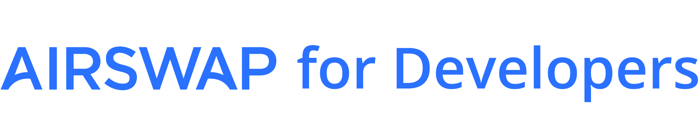

## What is AirSwap? {docsify-ignore-all}

[AirSwap](https://airswap.io/) is a peer-to-peer network for trading Ethereum ERC20 tokens. Peers connect to the network and use the [Swap](https://swap.tech/whitepaper/) protocol to find and execute trades:

* Makers: provide liquidity
* Takers: take liquidity

In general, Takers tend to use existing [dApps](dapps/widget.md) for price discovery and execution, while Makers tend to use our APIs and libraries to provide quotes and signed orders.

!> The following APIs are in use in production on the AirSwap network. We are sharing these APIs and code samples publicly with our community to build and iterate on them. By connecting to and using the AirSwap services you accept the [AirSwap Terms of Use](https://swap.tech/airswap-terms-of-use.pdf). Please also be sure to review the [LICENSE](LICENSE.md).

## Join the Conversation

Be sure to join the AirSwap Developers Telegram group at https://t.me/airswapdevs or the AirSwap Community at https://t.me/airswap.
