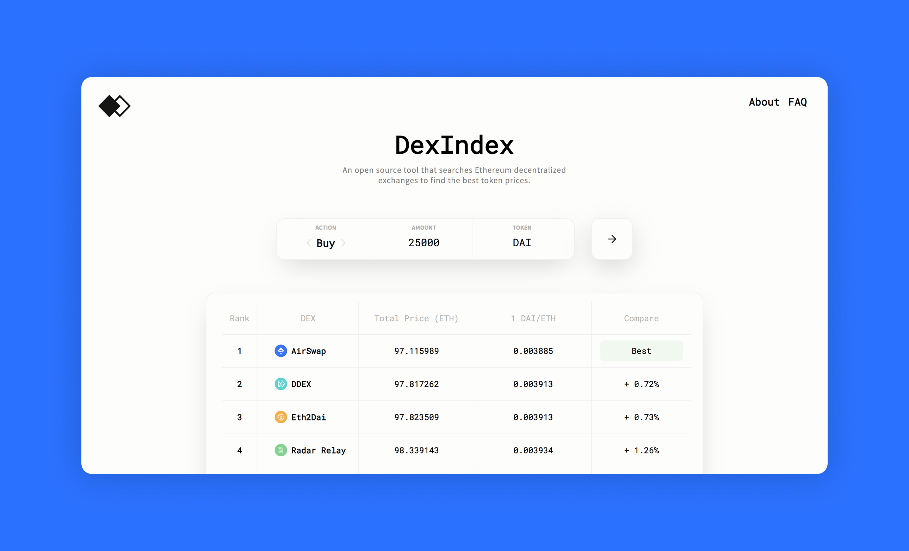

# DexIndex

[DexIndex] (https://dexindex.io/) is an an open-source price discovery tool that allows users to easily perform getQuote requests to all online  Makers. It aggregates price information from other DEXs to ensure you are always getting the best price.

Now that we've seen some dApps built on the AirSwap network, let's take a look at the [AirSwap API ⟶](/api/peers.md)
