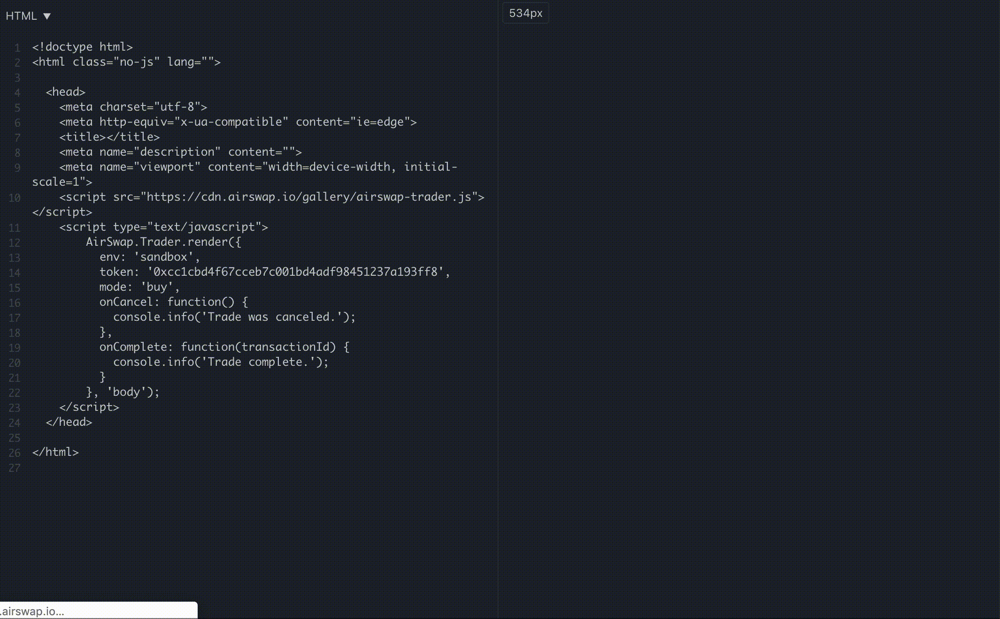

# Widget



The AirSwap Widget is an embeddable, HTML+JavaScript element that can be dropped into any webpage and be used by Takers to easily buy or sell Ethereum ERC20 tokens. The Widget is designed to provide instant access to liquidity for DEX aggregators, utility token-based dApps, and more.

!> Pop-up blockers can prevent the AirSwap Widget from loading properly.

### Example {docsify-ignore}

The following example will render a button that opens a Widget with a request to buy AST. You can try it out here: [JSFiddle](https://jsfiddle.net/ucra2tsq/).

```html
<head>
    <script src="https://cdn.airswap.io/gallery/airswap-trader.js"></script>
</head>
```

```js
AirSwap.Trader.render({
  env: 'sandbox',
  mode: 'buy',
  token: '0xcc1cbd4f67cceb7c001bd4adf98451237a193ff8',
  amount: 250 * (10 ** 4),
  onCancel: function () {
      console.info('Trade was canceled.');
  },
  onComplete: function(transactionId) {
      console.info('Trade complete.');
  }
},  'body');
```

## Options {docsify-ignore}

#### mode `string`, `required`

Either `buy` or `sell`. For example, choosing buy will create a widget that searches for makers that are selling a given token.

#### token `string`, `required`

The hex address of the token to swap in exchange for ETH, WETH, or `baseToken`. You can find a full list of indexed token metadata for: [Mainnet](https://token-metadata.airswap.io/tokens) or [Rinkeby](https://token-metadata.airswap.io/rinkebyTokens).


#### onComplete `function`, `required`

Called when the transaction sent to the blockchain has succeeded. The transaction ID is passed as an argument.

```js
function onComplete(transactionId) { console.log('Complete!', transactionId); }
```

#### onCancel `function`, `required`

A function called when the user has canceled or dismissed the widget. No arguments.

```js
function onCancel() { console.log('Canceled!'); }
```

#### baseToken `string`, `optional`

By default, the widget will search for trades in `ETH`. If you specify the string `DAI` for this parameter, the widget will search for token/DAI orders instead of token/ETH orders. **Note: most makers are only serving ETH orders. You will likely need to run a custom server until more peers on the network start making DAI orders.**

#### amount `string`, `optional`

A default amount in Wei. For example, 250 AST = 250 * (10 ** 4), because the AST token has 4 decimals. You can find a full list of indexed token metadata for: [Mainnet](https://token-metadata.airswap.io/tokens) or [Rinkeby](https://token-metadata.airswap.io/rinkebyTokens).

#### address `string`, `optional`

A fixed maker `address` to query a specific counterparty for orders.
